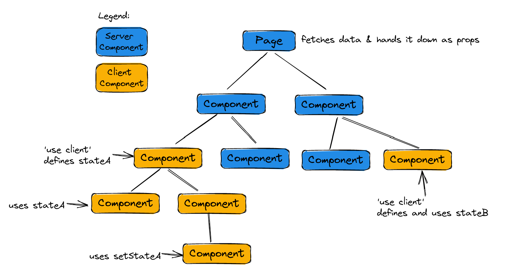
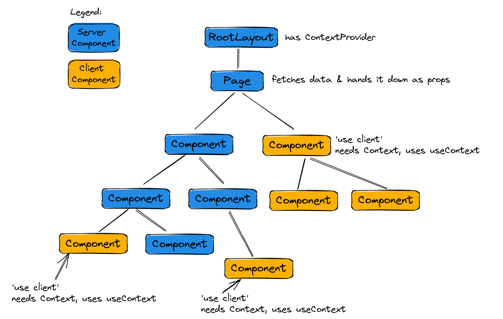
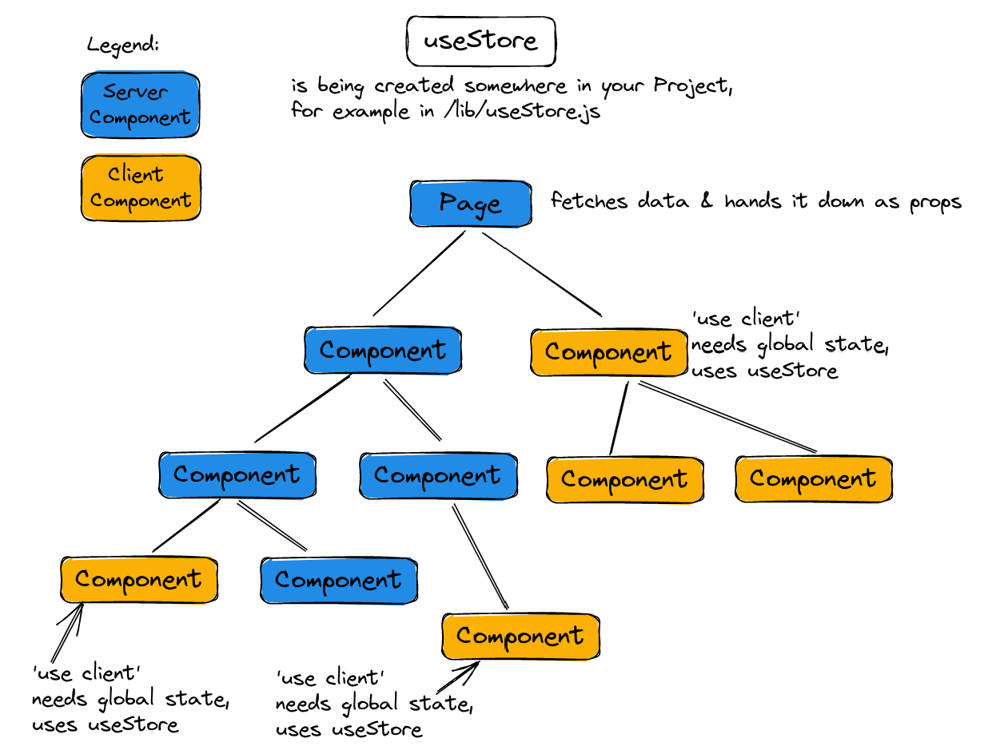

# Art Gallery Next.js 13 Challenge

Here you find a static Art Gallery App. Your job is to add interactivity:

- Fetch real data from the API instead of using the hard coded data. You can use the function provided in [/lib/fetchArtPieces.js](./lib/fetchArtPieces.js)
- Make the favorite buttons work, so that users can mark / unmark art pieces as favorites. Use localStorage to persist which pieces are favorites.
- Make the favorite page only show the favorite pieces.
- Make the details page show the details of the correct art piece.
- Make the comment form work and persist comments in localStorage.
- Make sure the details page gets statically generated at build time for all art pieces.
- Make the spotlight page show a random art pieces every time the user navigates to the page.

## Recipe: local state

- Make your Server Components fetch data and pass it down as props the whole tree through prop drilling
- Use local state only where you need it
- Place local state as far down in the component tree as possible



=> Hint: With this model, as soon as the user navigates to another page, the state is lost (as it normally is with React once the state holding component unmounts). You can use localStorage (or any other kind of storage) to have persisted state between page changes and browser reloads.

## Recipe: Context API

- Make your Server Components fetch data and pass it down as props the whole tree through prop drilling
- If you want to share client state over multiple pages you can place a provider component in the RootLayout component. Even though the provider component is a Client Component you can hand it Server Components through the children prop:

```js
export const CountContext = useContext();

export const CountContextProvider = ({ children }) => {
  const [count, setCount] = useState(0);

  return (
    <CountContext.Provider value={{ count, setCount }}>
      {children}
    </CountContext.Provider>
  );
};
```

```js
export default function RootLayout({ children }) {
  return (
    <html lang="en">
      <body>
        <main>
          <CountContextProvider>{children}</CountContextProvider>
        </main>
      </body>
    </html>
  );
}
```

- Make use of `useContext` in Client Components where needed. Try to push these uses of the context down the component tree.



## Recipe: Zustand

- Make your Server Components fetch data and pass it down as props the whole tree through prop drilling
- create your Zustand store with the client only state.
- Access the store from any Client Component that needs it through the `useStore` hook. Try to push these uses of the store down the component tree.



## Possible Recipe: Zustand stores in Server and Client components

- This is only for use when you are familiar with the inner workings of React and Zustand.
- You can use a Zustand store in your Server Components using `useStore.getState`, synchronize the store on the client side with the store on the server side on the first client render and use the store on the client side using `useStore` as a hook.
- Write a store initializer that sets the client store state once:

```js
"use client";

import { useRef } from "react";
import useStore from "./useStore";

/*
  Initializer sets state in client store exactly once before client
  rendering starts. Otherwise it could trigger component updates while
  the updated components are still rendering - thus causing errors (bad setState).
  Make sure to call with all relevant state on every page.
*/
function StoreInitializer({ state }) {
  const initialized = useRef(false);
  if (!initialized.current) {
    if (!useStore.getState().isInitialized) {
      useStore.setState({ ...state, isInitialized: true });
    }
    initialized.current = true;
  }
  return null;
}

export default StoreInitializer;
```

- Make use of the initializer and set the state to the server store in every page:

```js
export default async function Page() {
  const cards = await fetchData();

  // Setting state to the server store for Server Components to use
  useStore.setState({ cards });

  return (
    <>
      {/* StoreInitializer is setting state to the client store*/}
      <StoreInitializer state={{ cards }} />
      <MyComponent />
    </>
  );
}
```

In every Server Component that uses the state you can access it through:

```js
const cards = useStore.getState().cards;
```

In every Client Component that uses the state you can access it through `useStore` as a hook:

```js
const cards = useStore((state) => state.cards);
```
